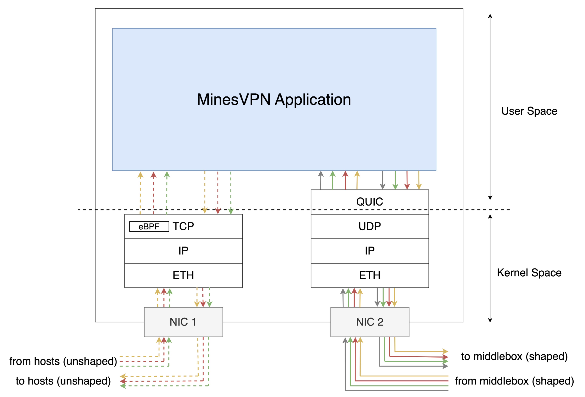

# MinesVPN  Documentation
In this docuemntation, we will explain how MinesVPN works and how to use it.
We break this documentation into multiple parts where each parts explain a specific component of the project.
<!--
# Adding a figure of the end to end architecture
--->

*MinesVPN End to End Architecture*

MinesVPN is a middlebox that manages and shapes outgoing network traffic.
It is an application running on a Linux machine that is connected to the Internet.
For now, we assume the incoming traffic is unshaped TCP/IP traffic.
The outgoing traffic is shaped to a pattern determined by the MinesVPN application and is transmitted over the public Internet with QUIC as the transport layer protocol.
In this project, we implement the MinesVPN application (highlighted in blue in the following figure).
For MinesVPN to be transparent to end users (i.e. users can use netwrok without knwoing MinesVPN traffic shaping is applied), we plan to implement an eBPF module that controls users TCP connnections and direct them to MinesVPN.
This eBPF module will be implemented in a separate project.

MinesVPN application consists of two main components: the Shaping component and the Unshaped component.
These components can be implemented in various ways, but their functionality must align with the overall design of MinesVPN.   
The unshaped component is responsible to manage the connection to end users. It receives the traffic and enqueues it into a single-consumer single-produce queue that is shared with the shaped component.   
The shaped component, on the other hand, manages the QUIC connection over the public Internet as is in charge of shaping the outgoing traffic and unshaping the incoming shaped traffc. We will elaborate on these components in the following sections.
The following figure represents the components of MinesVPN and their interactions with the rest of the network.

The shaped sender component is responsible for shaping the outgoing traffic and sending it over the public Internet.
Therefore, the shaping strategy is implemented in this component.
We use differential privacy to shape traffic, and for more information on shaping mechanism you can read our DP document.
For now, we assume the shaping strategy as a function that periodically measures the aggregated size of all queues and determines the number of bytes to be sent over the public Internet. 
To shape the data, the shaped sender adds a dummy stream to the QUIC connection and sends dummy data over it whenever it is needed.
For more information on MinesVPN design and components, you can read the [documentation](../src/Example/README.md) of our prototype implementation.

